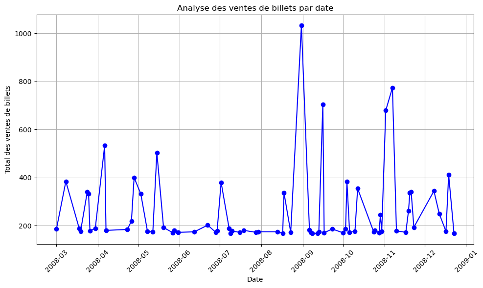
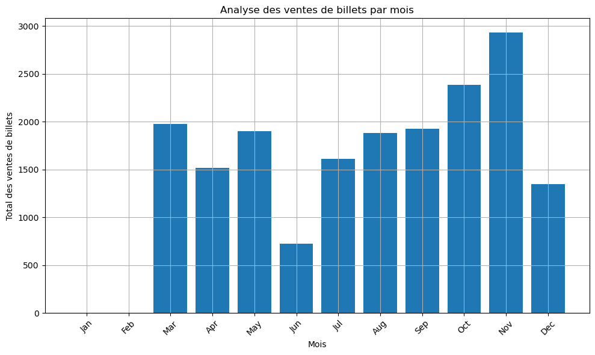
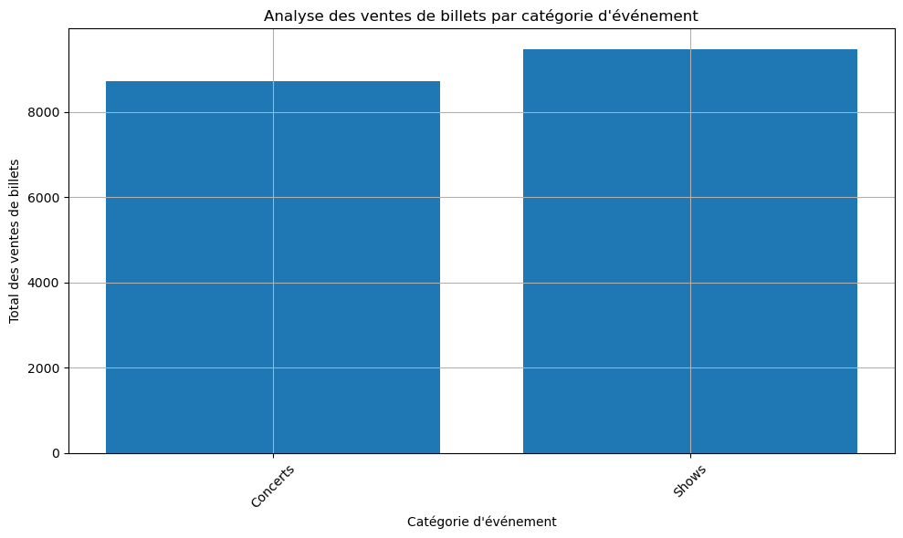
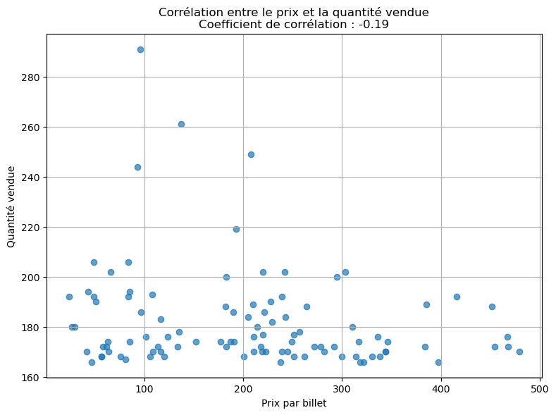
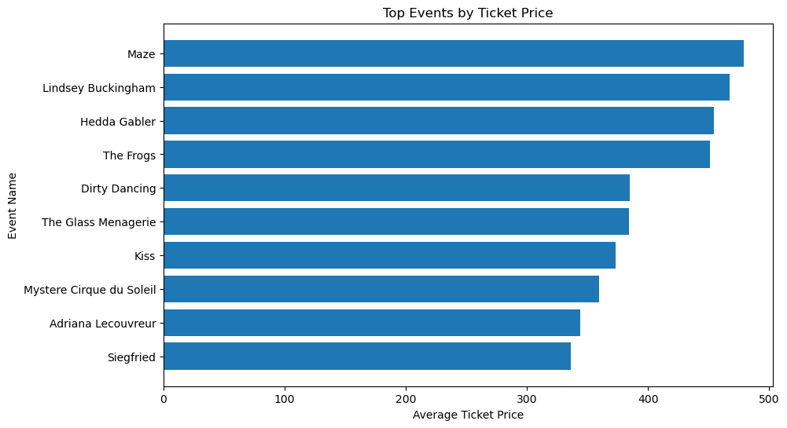
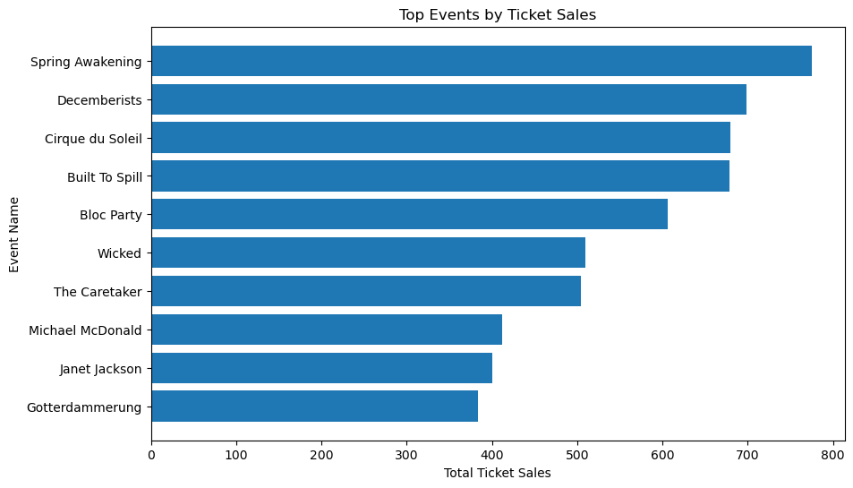

 
Data Analytics Project - Online Ticket Sales     
 
   
  
**Table of Contenst :**    

- [Dataset :](#dataset-)
  - [Overview :](#overview-)
  - [Data Dictionary :](#data-dictionary-)
  - [Accounting](#accounting)
  - [Analyze](#analyze)
  - [Visualize](#visualize)
# Dataset :    
this is a dataset of online ticket sales for various events. The aim of this analysis is to provide key information on sales performance, and to draw lessons for improving sales and pricing strategies.  

## Overview : 

The Online Ticket Sales Database contains information related to ticket sales for various events. The dataset consists of five columns:

caldate: This column represents the date of the ticket sale. It contains 100 non-null entries and is of the object data type.
eventname: This column contains the names of the events for which the tickets were sold. It also has 100 non-null entries and is of the object data type.
catgroup: The catgroup column categorizes the events into different groups or categories. Like the previous columns, it also has 100 non-null entries and is of the object data type.

priceperticket: This column represents the price of each ticket for the corresponding event. It has 100 non-null entries and is of the int64 data type.

qtysold: The qtysold column indicates the quantity or number of tickets sold for each event. Like the other numeric column, it has 100 non-null entries and is of the int64 data type.

|    | caldate                  | eventname            | catgroup   |   priceperticket |   qtysold |
|---:|:-------------------------|:---------------------|:-----------|-----------------:|----------:|
|  0 | 2008-11-02T00:00:00.000Z | Built To Spill       | Concerts   |               96 |       291 |
|  1 | 2008-11-19T00:00:00.000Z | Spring Awakening     | Shows      |              137 |       261 |
|  2 | 2008-12-12T00:00:00.000Z | All My Sons          | Shows      |              208 |       249 |
|  3 | 2008-10-29T00:00:00.000Z | Phantom of the Opera | Shows      |               93 |       244 |
|  4 | 2008-04-26T00:00:00.000Z | Shakira              | Concerts   |              193 |       219 | 

## Data Dictionary : 

| Column Name      | Description                                       | Data Type |
|------------------|---------------------------------------------------|-----------|
| caldate          | The date of the ticket sale.                     | object    |
| eventname        | The name of the event for which tickets were sold.| object    |
| catgroup         | The category group of the event.                 | object    |
| priceperticket   | The price of each ticket for the event.          | int64     |
| qtysold          | The quantity of tickets sold for the event.      | int64     | 

## Accounting ## 

1 -- Calculation of total number of tickets sold 

  💡The total number of tickets sold was : 18201  

2 -- Calculating total sales revenue   

  💡 Total sales revenue is: 3666394 

3 -- Calculation of average sales by event category 

  💡  Concerts :185.574468 ||  Shows : 178.849057 

4 -- Calculation of most active sales period  

  💡  The most active sales period was on 2008-08-31 00:00:00+00:00 with a total of 1034 tickets sold.

##  Analyze ##    

1 -- Analysis sales by date 
 
2 -- Analysis of sales by month 
 
3 -- Analysis of sales by event category 
 
4 -- Analysis of the correlation between price and quantity sold 
 

##  Visualize ## 

1 -- Visualize the top events by price 
 
2 -- Visualize the top events by ticket sales 
 

